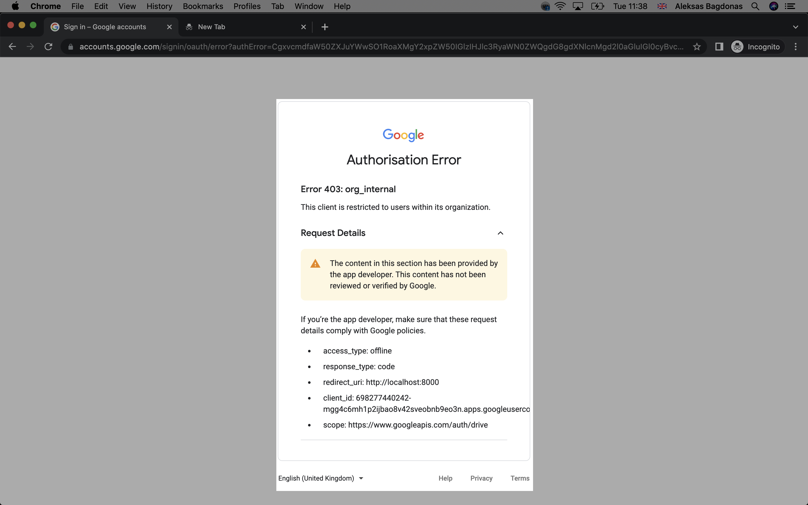

Required files to run the functions:

client-secret.json

{
"installed": {
...
}
}

It contains:
client_secret,
client_id,
redirect_uris

It's required in the authorize function to create a new token.
After creating client-secret.json in a src folder, run `node index.js` from the src directory.

Then in the console the URL will be provided which you need to press in order to authorize this app.

In the bottom line of the console, there should be a line:
`Enter the code from that page here: `

You can get this code after logging in with the given URL and copying the code from the search bar. It should look something like this:
4%2F0AdQt8qhWtRUA5QKCSdnBkBaoIpzUoSSocxSYDVbw0BPr-e9V1r_oHGfAP9ENwtMT5rpuWw.
You should cut it from the URL in a search bar:

`http://localhost:8000/?code=4%2F0AdQt8qhWtRUA5QKCSdnBkBaoIpzUoSSocxSYDVbw0BPr-e9V1r_oHGfAP9ENwtMT5rpuWw&scope=https%3A%2F%2Fwww.googleapis.com%2Fauth%2Fdrive`

Important: In order to follow following steps, you need to be added to an organization, if not you will receive this error:

In order to call the functions chain which includes functions:

1. Create a new sheet with custom title
2. Copies the default sheet with its theme settings and default cell values. Default spreadsheet is specified by spreadsheet id and sheet id. The function copies into a sheet created in a first step by getting response and it's parameter created spreadsheet id, it is passed as a resource (argument) "destinationSpreadsheetId" to the copy function. Copied sheet title will have a same name as default sheet just with "Copy of" prior name.

FIXME: This needs a function which changes the sheet title.

FIXME: Created spreadsheet creates Sheet1 which needs to be removed. Alternatively, we can rename sheet name on the default spreadsheet from Timetable to Sheet1 and later rename it after a copy is made.

3. Write custom values into specific ranges of the sheet.

TODO: need to consider which cells need to be changed automatically (such as dates), manually (names?), and which cells need to remain the same in all the sheets.
